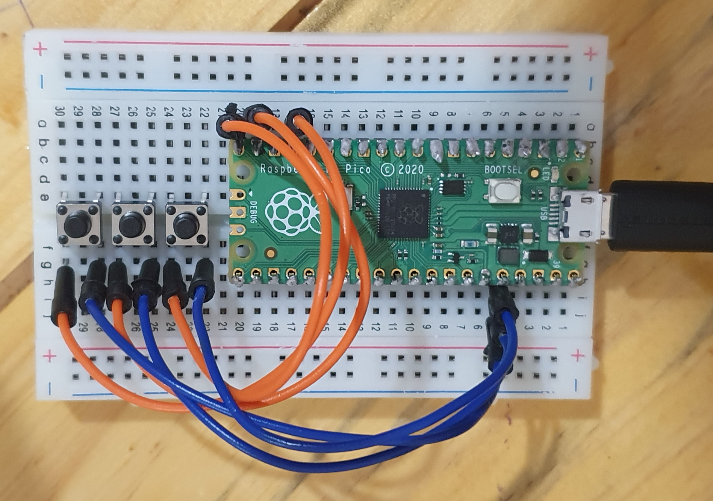

# PicoMe

> PicoMe is a basic macro api. It's objective is to enable users to build their own custom "human like" macro scripts with an easy api.The project target the Raspberry Pico Micro Controller board using CircuitPython. The board scheme configuration is shown above.

## Capabilities

The project is still in development and focused in the human keyboard api.

- [ ] Human like single key press. Ex: press the 'x' key.
- [ ] Human like sequenced key presses. Ex: Rapdly press the 'x' key a number of times.
- [ ] Internal human like timers, sleepers, randomizers. 
- [ ] Customizable interfaces, etc.

### 💻 Requirements

Before you start, check if you have the following items:
<!---Estes são apenas requisitos de exemplo. Adicionar, duplicar ou remover conforme necessário--->
* You have a Raspberry Pico with CircuitPython. 
* You have the CircuitPython keyboard libs.
### 📝 Licença

Esse projeto está sob licença. Veja o arquivo [LICENÇA](LICENSE.md) para mais detalhes.

[⬆ Voltar ao topo](#PicoMe) 